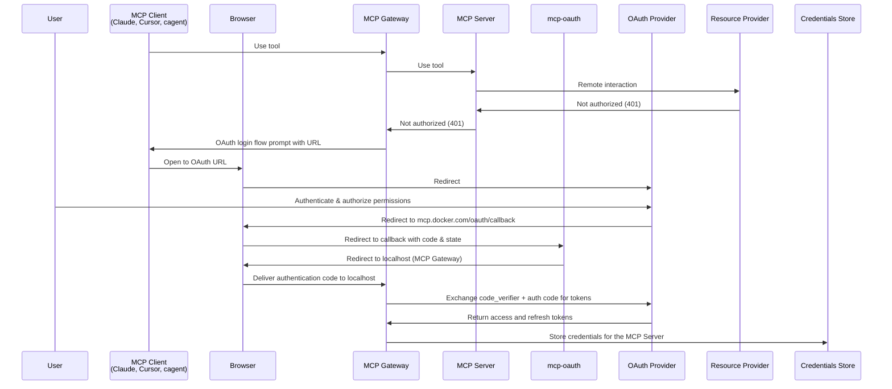

# MCP Gateway Direct OAuth Flow Implementation Plan

## Overview

This document outlines the implementation plan for enabling direct OAuth flows between MCP Gateway and OAuth providers (starting with GitHub) without dependency on Docker Desktop. The solution uses the existing mcp-oauth service as a redirect proxy while maintaining full backward compatibility.

## Architecture

### Current State
```
MCP Client → mcp-gateway → MCP Servers (containers)
                ↓
         Docker Desktop Auth API
                ↓
         mcp-oauth (mcp.docker.com)
                ↓  
         Third-party OAuth Providers
```

### Target State
```
MCP Client → mcp-gateway → MCP Servers (containers)
                ↓
         Direct OAuth Flow
                ↓
         mcp-oauth (mcp.docker.com) [redirect proxy]
                ↓
         GitHub OAuth Provider
```

## Sequence Diagram



## Implementation Phases

### Phase 1: mcp-oauth Service Changes ✅ COMPLETED

**Objective**: Enable intelligent routing based on OAuth state parameter

**Changes Made**:
- ✅ Added intelligent callback routing in `/oauth/callback`
- ✅ Implemented state-based flow differentiation
- ✅ Added `RedirectToMCPGateway` function for localhost redirects
- ✅ Maintained full backward compatibility with Docker Desktop

**Key Features**:
- **No GitHub OAuth app changes needed** - same client ID, secret, and redirect URI
- **State parameter differentiation**:
  - Docker Desktop: `state="docker-desktop-session-123"` → CSRF form flow
  - MCP Gateway: `state="mcp-gateway:http%3A//localhost%3A8080/oauth/callback"` → direct redirect
- **Security**: Localhost-only redirects (127.0.0.1, localhost)
- **Validation**: Proper URL encoding/decoding with error handling

### Phase 2: mcp-gateway OAuth Client Implementation [IN PROGRESS]

**Objective**: Implement full OAuth 2.1 PKCE flow in MCP Gateway

**Components to Implement**:

#### 2.1 OAuth Client with PKCE Support
- [ ] Generate `code_verifier` and `code_challenge` (SHA256, base64url)
- [ ] Create GitHub OAuth authorization URLs
- [ ] Manage OAuth state with localhost callback URL
- [ ] Handle OAuth 2.1 PKCE flow end-to-end

#### 2.2 Localhost HTTP Server
- [ ] Dynamic port allocation for OAuth callbacks
- [ ] Route: `GET /oauth/callback` to receive auth codes
- [ ] Server lifecycle: start before OAuth → shutdown after token exchange
- [ ] Error handling and timeout management

#### 2.3 401 Response Interceptor
- [ ] Enhance existing interceptor in `internal/interceptors/`
- [ ] Detect 401 unauthorized responses from MCP servers
- [ ] Generate OAuth authorization URLs
- [ ] Return OAuth prompts to MCP clients

#### 2.4 Token Exchange Implementation
- [ ] Exchange authorization code + code_verifier for tokens
- [ ] Handle OAuth error responses
- [ ] Support refresh token flows
- [ ] Implement token expiration handling

#### 2.5 Credential Store Integration
- [ ] Abstract credential storage from Docker Desktop dependencies
- [ ] Direct credential store access (file-based or Docker secrets)
- [ ] Associate tokens with MCP server configurations
- [ ] Implement secure token storage and retrieval

### Phase 3: GitHub OAuth Configuration

**Objective**: Configure GitHub-specific OAuth parameters

**Configuration**:
- [ ] GitHub OAuth endpoints (auth, token, revoke)
- [ ] Required scopes per MCP server type
- [ ] Client ID configuration (environment/config file)
- [ ] Error handling for GitHub-specific responses

### Phase 4: Testing & Validation

**Objective**: Comprehensive testing of the OAuth flow

**Test Coverage**:
- [ ] End-to-end OAuth flow testing
- [ ] PKCE parameter validation
- [ ] State parameter handling
- [ ] Error scenarios (network failures, invalid codes)
- [ ] Concurrent OAuth flows
- [ ] Token refresh scenarios
- [ ] Backward compatibility with Docker Desktop

## Key Design Decisions

### 1. State Parameter Strategy ✅
**Decision**: Use state parameter to differentiate between Docker Desktop and MCP Gateway flows
**Format**: 
- Docker Desktop: `"docker-desktop-session-id"`  
- MCP Gateway: `"mcp-gateway:http%3A//localhost%3A8080/oauth/callback"`

**Benefits**:
- Single GitHub OAuth app
- No additional redirect URIs needed
- Clean separation of concerns
- Backward compatibility guaranteed

### 2. Security Model
**PKCE Implementation**: OAuth 2.1 with PKCE for public clients
**Localhost Validation**: Strict localhost/127.0.0.1 validation
**Token Storage**: Direct credential store integration
**State Validation**: Proper URL encoding and validation

### 3. Backward Compatibility
**Docker Desktop**: Zero changes to existing flow
**mcp-oauth**: Intelligent routing preserves all existing functionality
**GitHub OAuth**: Same app configuration works for both flows

## Risk Analysis & Mitigation

### Identified Risks

1. **Localhost Server Security**
   - *Risk*: Local processes accessing callback endpoint
   - *Mitigation*: Random ports, state validation, short server lifecycle

2. **OAuth Parameter Preservation**
   - *Risk*: Parameters lost in redirect chain
   - *Mitigation*: Standard query parameters, GitHub compatibility testing

3. **Deployment Coordination**
   - *Risk*: mcp-oauth deployment requires ops team coordination
   - *Mitigation*: Staging environment testing, backward compatibility

4. **Credential Store Dependencies**
   - *Risk*: Docker Desktop API coupling
   - *Mitigation*: Abstraction layer, fallback storage options

### Success Criteria

- [ ] Complete OAuth flow without Docker Desktop
- [ ] GitHub API access with obtained tokens
- [ ] Docker Desktop flow remains unaffected
- [ ] No additional GitHub OAuth app configuration needed
- [ ] Secure token storage and management

## Deployment Strategy

1. **mcp-oauth staging deployment** ✅ (ready for testing)
2. **mcp-gateway local testing** (against staging)
3. **mcp-oauth production deployment**
4. **mcp-gateway release** with OAuth support

## Next Steps

1. **Implement OAuth client in mcp-gateway** (Phase 2.1)
2. **Create localhost HTTP server** (Phase 2.2) 
3. **Add 401 response interceptor** (Phase 2.3)
4. **Test end-to-end flow** against staging mcp-oauth

## Configuration Requirements

### GitHub OAuth App
- **Client ID**: Existing (no changes)
- **Client Secret**: Existing (no changes)  
- **Redirect URI**: `https://mcp.docker.com/oauth/callback` (existing)

### Environment Variables (MCP Gateway)
```bash
GITHUB_CLIENT_ID=<existing-client-id>
MCP_OAUTH_BASE_URL=https://mcp.docker.com  # or mcp-stage.docker.com for staging
```

---

*Last Updated: January 2025*
*Status: Phase 1 Complete, Phase 2 In Progress*