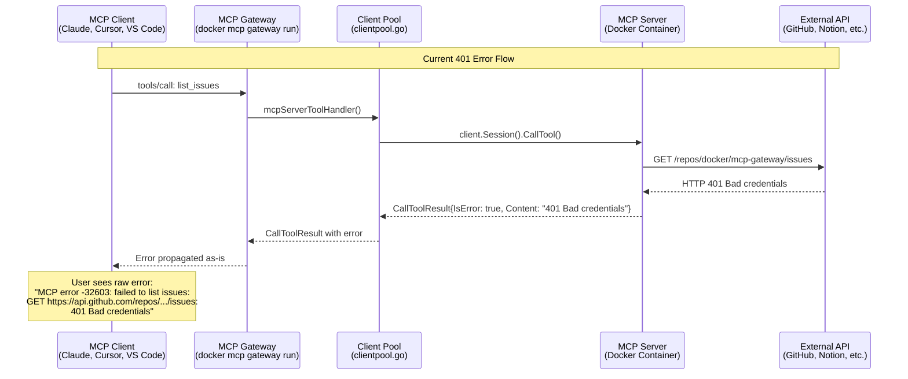
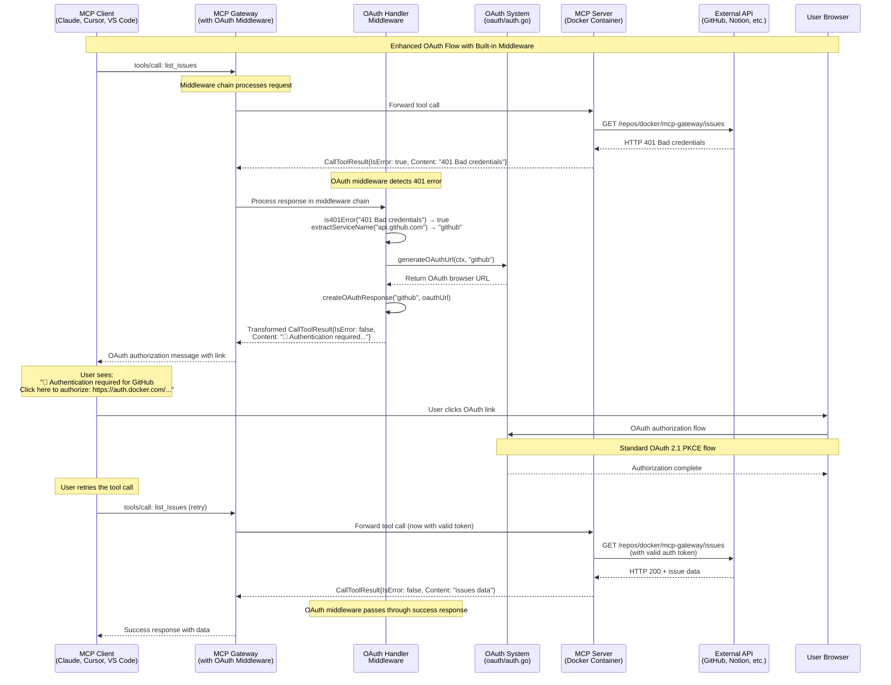

# OAuth 401 Error Handling with Built-in Middleware

## Overview

This document details how to use the MCP Gateway's built-in middleware system to detect OAuth 401 errors and transform them into actionable OAuth authorization links for seamless user experience.

## Current 401 Error Flow

### Architecture Analysis

The MCP Gateway acts as a proxy between MCP clients and MCP servers running in Docker containers. When a 401 authentication error occurs, it flows through multiple layers:



### Key Components in Error Flow

1. **MCP Client** (`cmd/docker-mcp/tools/call.go:37`): Checks `response.IsError` and displays error text
2. **Gateway Handlers** (`cmd/docker-mcp/internal/gateway/handlers.go:47`): Routes tool calls to client pool
3. **Client Pool** (`cmd/docker-mcp/internal/gateway/clientpool.go:175-180`): Returns `CallToolResult` with `IsError: true`
4. **MCP Server Container**: Makes actual API calls and receives HTTP 401 responses

### Error Structure

The 401 error information is embedded in the `CallToolResult.Content` as text:

```go
// From clientpool.go:175-180
return &mcp.CallToolResult{
    Content: []mcp.Content{&mcp.TextContent{
        Text: "MCP error -32603: failed to list issues: GET https://api.github.com/repos/docker/mcp-gateway/issues: 401 Bad credentials",
    }},
    IsError: true,
}, nil
```

## Built-in Middleware OAuth Solution

### Feasibility Analysis

✅ **Can Detect 401s**: Middleware has full access to `CallToolResult.Content` text
✅ **Can Transform Response**: Middleware can modify the response before returning to client
✅ **OAuth Integration**: Existing OAuth system can generate authorization URLs
✅ **In-Process Performance**: No serialization overhead, runs within gateway process

### Middleware Architecture

```mermaid
graph TB
    subgraph "MCP Gateway Process"
        MC[MCP Client] --> MW[Built-in Middleware Chain]
        MW --> LC[LogCallsMiddleware]
        LC --> BS[BlockSecretsMiddleware] 
        BS --> OH[OAuthHandlerMiddleware<br/>NEW]
        OH --> TH[Tool Handler]
        TH --> OH
        OH --> BS
        BS --> LC
        LC --> MW
        MW --> MC
    end
    
    subgraph "OAuth Handler Middleware"
        OH --> AI{401 Detected?}
        AI -->|Yes| OG[Generate OAuth URL]
        AI -->|No| PR[Pass Response Through]
        OG --> TR[Transform Response]
        TR --> RT[Return OAuth Link]
        PR --> RT
    end
    
    subgraph "OAuth Integration"
        OG --> OA[oauth/auth.go<br/>PostOAuthApp()]
        OG --> DT[desktop/auth.go<br/>NewAuthClient()]
    end
    
    subgraph "External"
        TH --> MS[MCP Server Container]
        MS --> API[External API<br/>GitHub, Notion, etc.]
    end
    
    style OH fill:#e1f5fe
    style OG fill:#f3e5f5
    style TR fill:#e8f5e8
```

### Implementation Strategy

1. **Built-in Middleware**: Runs within gateway process to inspect responses after tool calls
2. **Pattern Matching**: Parse `Content` text for "401" and authentication-related errors  
3. **OAuth URL Generation**: Use existing `cmd/docker-mcp/oauth/auth.go` system
4. **Response Transformation**: Replace error content with clickable OAuth link
5. **Configuration Flag**: Enable via `--oauth-handler` flag (similar to `--log-calls`, `--block-secrets`)

## Implementation Details

### 1. Built-in OAuth Middleware

Following the existing pattern in `cmd/docker-mcp/internal/interceptors/`:

```go
// oauth_handler.go
package interceptors

import (
    "context"
    "encoding/json"
    "strings"

    "github.com/modelcontextprotocol/go-sdk/mcp"
    "github.com/docker/mcp-gateway/cmd/docker-mcp/internal/desktop"
)

func OAuthHandlerMiddleware() mcp.Middleware[*mcp.ServerSession] {
    return func(next mcp.MethodHandler[*mcp.ServerSession]) mcp.MethodHandler[*mcp.ServerSession] {
        return func(ctx context.Context, session *mcp.ServerSession, method string, params mcp.Params) (mcp.Result, error) {
            // Only handle tools/call method
            if method != "tools/call" {
                return next(ctx, session, method, params)
            }

            // Call the next handler first
            result, err := next(ctx, session, method, params)
            if err != nil {
                return result, err
            }

            // Check for 401 OAuth errors and transform if needed
            if transformedResult := checkAndTransformOAuth401(ctx, result); transformedResult != nil {
                return transformedResult, nil
            }

            return result, nil
        }
    }
}

func checkAndTransformOAuth401(ctx context.Context, result mcp.Result) *mcp.CallToolResult {
    // Convert result to CallToolResult for inspection
    var toolResult mcp.CallToolResult
    if jsonData, err := json.Marshal(result); err == nil {
        if err := json.Unmarshal(jsonData, &toolResult); err == nil {
            
            // Only process error responses
            if !toolResult.IsError {
                return nil
            }

            // Check for 401 authentication errors
            for _, content := range toolResult.Content {
                if textContent, ok := content.(*mcp.TextContent); ok {
                    text := textContent.Text
                    
                    if is401Error(text) {
                        service := extractServiceName(text)
                        if oauthUrl, err := generateOAuthUrl(ctx, service); err == nil {
                            return createOAuthResponse(service, oauthUrl)
                        }
                    }
                }
            }
        }
    }
    
    return nil
}

func is401Error(text string) bool {
    return strings.Contains(text, "401") && 
           (strings.Contains(text, "Bad credentials") || 
            strings.Contains(text, "Unauthorized") ||
            strings.Contains(text, "authentication"))
}
```

### 2. OAuth URL Generation

```go
func generateOAuthUrl(ctx context.Context, service string) (string, error) {
    // Use Docker Desktop auth client (following oauth/auth.go pattern)
    client := desktop.NewAuthClient()
    
    authResponse, err := client.PostOAuthApp(ctx, service, "")
    if err != nil {
        logf("  - Failed to generate OAuth URL for %s: %v\n", service, err)
        return "", err
    }
    
    logf("  - Generated OAuth URL for %s\n", service)
    return authResponse.BrowserURL, nil
}

func extractServiceName(errorText string) string {
    // Extract service from common API URLs
    if strings.Contains(errorText, "api.github.com") {
        return "github"
    }
    if strings.Contains(errorText, "api.notion.com") {
        return "notion"
    }
    if strings.Contains(errorText, "slack.com/api") {
        return "slack"
    }
    
    // Default fallback
    return "unknown"
}
```

### 3. Response Transformation

```go
func createOAuthResponse(service string, oauthUrl string) *mcp.CallToolResult {
    return &mcp.CallToolResult{
        Content: []mcp.Content{&mcp.TextContent{
            Text: fmt.Sprintf(`🔐 Authentication required for %s

Click here to authorize: %s

After authorization completes, please retry your request.

Service: %s`, strings.ToTitle(service), oauthUrl, service),
        }},
        IsError: false, // Changed to false so client treats as informational, not error
    }
}
```

### 4. Middleware Integration

The OAuth middleware integrates into the existing system via these changes:

#### A. Add to Gateway Options (`cmd/docker-mcp/internal/gateway/config.go`):
```go
type Options struct {
    Port             int
    Transport        string
    ToolNames        []string
    Interceptors     []string
    Verbose          bool
    LongLived        bool
    DebugDNS         bool
    LogCalls         bool
    BlockSecrets     bool
    BlockNetwork     bool
    VerifySignatures bool
    DryRun           bool
    Watch            bool
    Cpus             int
    Memory           string
    Static           bool
    Central          bool
    OAuthHandler     bool  // NEW: Enable OAuth 401 handling
}
```

#### B. Update Middleware Registration (`cmd/docker-mcp/internal/interceptors/interceptors.go`):
```go
func Callbacks(logCalls, blockSecrets, oauthHandler bool, interceptors []Interceptor) []mcp.Middleware[*mcp.ServerSession] {
    var middleware []mcp.Middleware[*mcp.ServerSession]

    // Add custom interceptors
    for _, interceptor := range interceptors {
        middleware = append(middleware, interceptor.ToMiddleware())
    }

    // Add log calls middleware
    if logCalls {
        middleware = append(middleware, LogCallsMiddleware())
    }

    // Add block secrets middleware
    if blockSecrets {
        middleware = append(middleware, BlockSecretsMiddleware())
    }

    // Add OAuth handler middleware  
    if oauthHandler {
        middleware = append(middleware, OAuthHandlerMiddleware())
    }

    return middleware
}
```

#### C. Update Gateway Setup (`cmd/docker-mcp/internal/gateway/run.go`):
```go
// Add interceptor middleware to the server
middlewares := interceptors.Callbacks(g.LogCalls, g.BlockSecrets, g.OAuthHandler, parsedInterceptors)
if len(middlewares) > 0 {
    g.mcpServer.AddReceivingMiddleware(middlewares...)
}
```

## Improved User Experience Flow



## Benefits

### Technical Benefits

1. **High Performance**: In-process execution, no serialization or network overhead
2. **Simple Integration**: Follows existing middleware patterns (`--log-calls`, `--block-secrets`)
3. **Composable**: Stacks with other middleware in the processing chain
4. **Type Safe**: Direct access to Go structs, no JSON marshaling/unmarshaling required
5. **Easy Debugging**: Single process, standard Go debugging tools work

### User Experience Benefits

1. **Actionable Errors**: Transform cryptic 401s into clear next steps
2. **One-Click Authorization**: Direct links to OAuth flows
3. **Context Preservation**: User can retry after authorization
4. **Universal Client Support**: Works with any MCP client (Claude, Cursor, VS Code)

## Implementation Roadmap

### Phase 1: Core Detection
- [ ] Build 401 pattern matching logic
- [ ] Integrate with existing OAuth URL generation
- [ ] Create basic HTTP interceptor implementation

### Phase 2: Response Transformation  
- [ ] Implement response modification logic
- [ ] Add service name extraction from error messages
- [ ] Test with multiple OAuth providers (GitHub, Notion, etc.)

### Phase 3: Production Ready
- [ ] Add comprehensive error handling
- [ ] Implement retry logic coordination
- [ ] Add configuration options for OAuth flows
- [ ] Documentation and examples

## Configuration Examples

### Basic OAuth Handling

```bash
docker mcp gateway run \
  --oauth-handler \
  --log-calls \
  --verbose
```

### With GitHub Server

```bash
docker mcp gateway run \
  --oauth-handler \
  --servers github-server \
  --log-calls
```

### Complete Production Setup

```bash
docker mcp gateway run \
  --oauth-handler \
  --log-calls \
  --block-secrets \
  --servers github-server,notion-server \
  --port 8080 \
  --transport streaming
```

### Development Mode

```bash
docker mcp gateway run \
  --oauth-handler \
  --log-calls \
  --verbose \
  --dry-run
```

## Security Considerations

1. **OAuth State Management**: Use secure state parameters in OAuth flows
2. **Token Storage**: Leverage Docker Desktop's secure secret storage
3. **Redirect Validation**: Validate OAuth redirect URLs
4. **Error Information**: Avoid leaking sensitive details in transformed responses

## Summary

The built-in middleware approach is **superior to external interceptors** for OAuth 401 handling:

| **Built-in Middleware** | **External Interceptors** |
|------------------------|---------------------------|  
| ✅ In-process, high performance | ❌ Cross-process overhead |
| ✅ Type-safe Go struct access | ❌ JSON serialization required |
| ✅ Simple `--oauth-handler` flag | ❌ Complex external service setup |
| ✅ Easy debugging & maintenance | ❌ Multi-process debugging complexity |
| ✅ Follows existing patterns | ❌ Additional deployment complexity |

## Implementation Recommendation

**Use the built-in middleware approach** by:

1. **Create `oauth_handler.go`** in `cmd/docker-mcp/internal/interceptors/`
2. **Add `OAuthHandler bool`** to `gateway.Options` struct
3. **Update `interceptors.Callbacks()`** to include OAuth middleware
4. **Add `--oauth-handler`** command line flag
5. **Integrate with existing `oauth/auth.go`** OAuth system

The solution is:
- ✅ **High Performance**: In-process execution with no overhead
- ✅ **Simple Integration**: Follows existing middleware patterns
- ✅ **User-Friendly**: Transforms 401 errors into actionable OAuth links
- ✅ **Production Ready**: Reliable, debuggable, and maintainable